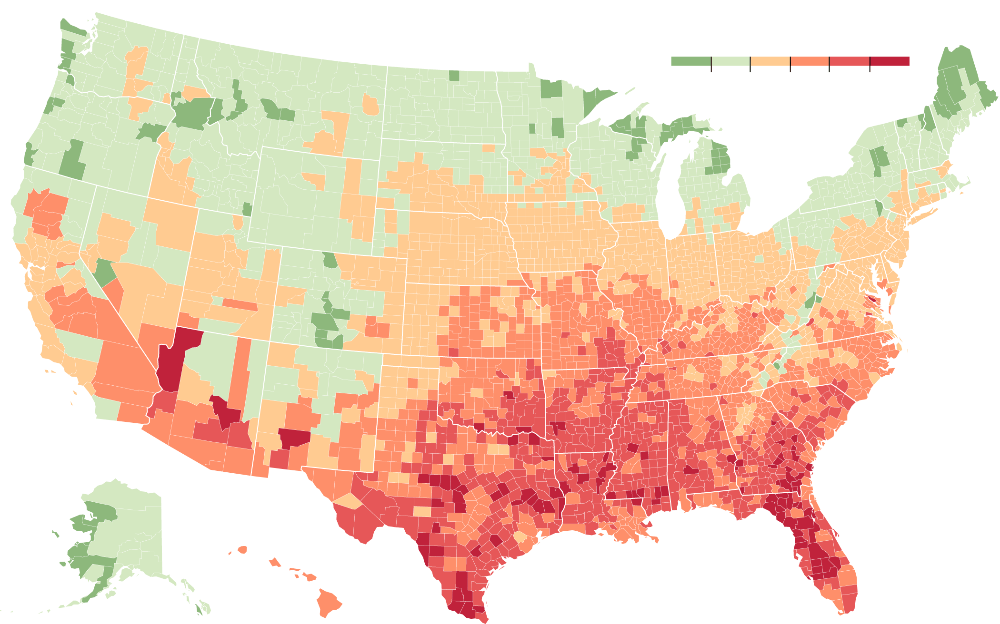
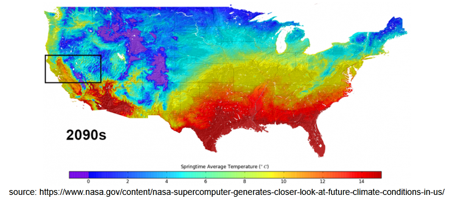

# Lab 3: An exploration of climate Change in the USA!
## Author: Thomas Braun
[Enter site](https://tbraun96.github.io/lab3/)

Herein lies an exploration of our climate's change across time. I performed a regression analysis on OSU's PRISM data to obtain the Relative Climate Pressure Index, and juxtaposed it to from another data source to validate the findings. Notice how all 3 maps below are very similar

 Above: From https://www.nytimes.com/interactive/2017/06/29/climate/southern-states-worse-climate-effects.html

### Credits
 - Video: https://climate.nasa.gov/climate_resources/101/video-global-temperature-variation/
 - Favicon: IconFinder
 - Javascript Libraries: D3.js, C3.js, Leaflet.js
 - Climate Data (Dynamic Maps): https://www.kaggle.com/berkeleyearth/climate-change-earth-surface-temperature-data
 - Climate Data (Charts): PRISM Project @ Oregon State University
 - HTML/JS/CSS libs: [WebSlides](https://webslides.tv/)
 - Google Fonts: https://fonts.googleapis.com/css?family=Playfair+Display&display=swap